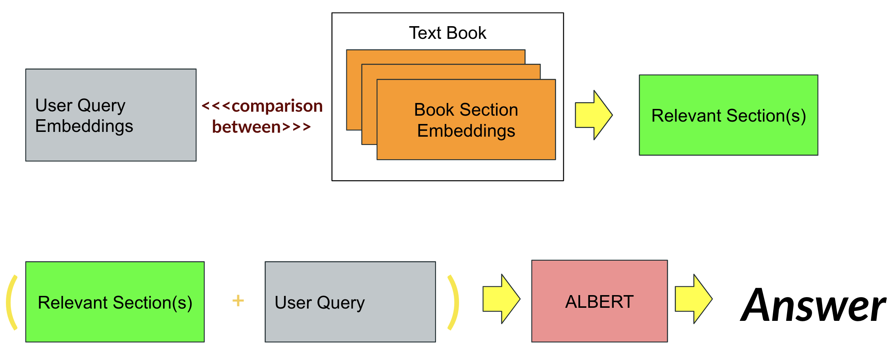

# AskAi
Building a Question Answering system with [ALBERT](https://ai.googleblog.com/2019/12/albert-lite-bert-for-self-supervised.html) on SQuAD dataset for large documents, namely textbooks.

<p align="center">
  <a href="#" > </img></a>
</p>

## Overview
Modern information retrieval techniques are successful in retrieving information from smaller documents. However, when it comes to larger documents, current options fall short. This repository attempts to solve the problem of performing Question Answering on large documents. This requires a two part approach. In one part, ALBERT is trained on the SQuAD QA dataset. In the other, we fragment a textbook into multiple sections using a rule based approach. We can then compare user question embeddings to the embeddings of the sections to find the most relevant section(s). 

Both parts come together when relevant sections along with the user question are passed to ALBERT to produce the predicted answer:



To follow along with any section(s) below, clone this reposiroty:

```git clone https://github.com/devkosal/albert-qa/ | cd albert-qa```

and install requirements:

```pip install -r requirements.txt```


## Training ALBERT

In this module, we train Albert on the [SQuAD 2.0](https://rajpurkar.github.io/SQuAD-explorer/) dataset.

1. Parse the json files to create csv files 

These will be easier for our dataloaders to read. Use the following script (`output dir` should contain the train and dev json files from SQuAD):

`python squad_parser.py path/to/json/dir path/to/output/dir`


2. Set the model configuration

Mmodel confgurations are used to set parameters and options for training, including data path directory. For examples and a full description of the options, view the [configs readme](https://github.com/devkosal/askai/tree/master/configs).

3. Execute the training command:

`python scripts/train_albert_on_squad.py path/to/modeling/config`

For example: `python scripts/train_albert_on_squad.py configs/modeling-base.json`

After training, model weights ```pytorch_model.bin```and config ```config.json``` will be stored in the `output_path` directory as in the configuration.

## Demo

You can now use the trained weights to demo the application. Our app uses Pyviz's Panel to serve the end application. Run the following command to serve the app locally:

```panel serve --show askai_app.py --args="path/to/weights"```

## Building Custom Examples

Two examples are provided by default under the ```examples``` directory. This module will cover the steps to create your own. Each example has the same directory structure:

```
sections.csv (or sections.db)
tfidf-vectors.npz
vectorizer.pkl
book-config.json
cover.png (or cover.jpg)
```

We will walk through creating each of these.

### Parsing Large Documents

Only HTML files of textbooks are accounted for at this time. Use the ```book_parser.py``` to convert your html file to csv `sections.csv` which separates sections and returns sections with unique ids.  

`python scripts/book_parser.py path/to/html/file path/to/output`

If you wish to convert to jsonl instead, add `--jsonl` as an argument.

When dealing with larger data, it may be better to convert the data into a relational database `sections.db` instead of a csv. For this, you can use a jsonl file with [DrQA's retreiver script](https://github.com/facebookresearch/DrQA/tree/master/scripts/retriever#storing-the-documents) to create a sqlite db.

### TF-IDF Embeddings 

We use TF-IDF embeddings to compare queries to sections. This helps us find relevant sections. To build our TF-IDF vectorizer `vectorizer.pkl` and sparse matrix embeddings `tfidf-vectors.npz`, use:

`python scripts/create_tfidf.py path/to/csv_or_db_file path/to/output`

If passing in a db file, make sure you have used the retriever script above or your db format is:

```
table: documents
columns: id, text
```

### Configuration

Configuration `book-config.json` is a json file which carries the following information:

```
{
    "book_name":"test_book_name",
    "book_link":"test_book_link",
    "sections_file_type": "db OR csv",
    "sample_questions": ["what is health?"]
}
```
Also add your document's cover image as a PNG `cover.png` of JPG `cover.jpg` file. 

### Custom Example Demo

Finally, name the folder containing `your_example_name` and place it in the examples directory. To deploy, run:

`panel serve --show askai_app.py --args=path/to/model_weights/, your_example_name`

### Docker Deployment

You can also use a docker container to deploy the app. See the following the example docker commands to build and run a docker image:

```
docker build -t askai . -f docker/Dockerfile 
docker run -p 5006:5006 --rm --name app  askai 

```

If you wish to deploy your own example, add `"--args=path/to/model_weights/, your_example_name"` option to the `CMD` line in `docker/Dockerfile`
